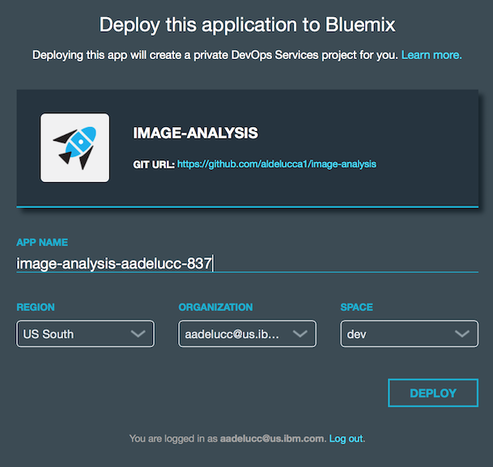
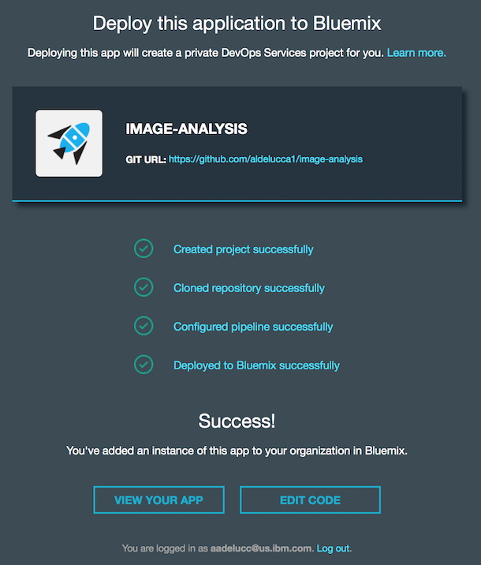
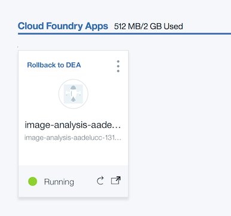
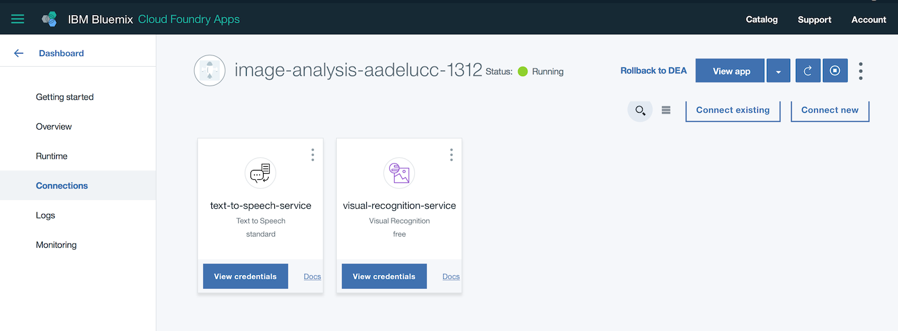
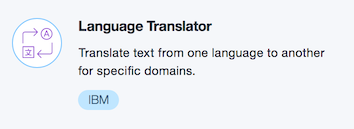
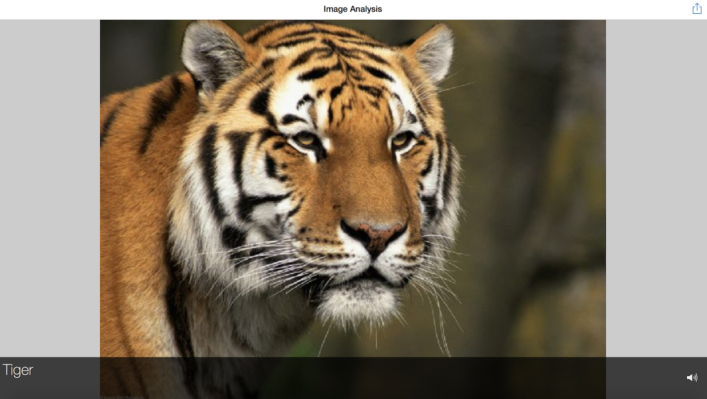
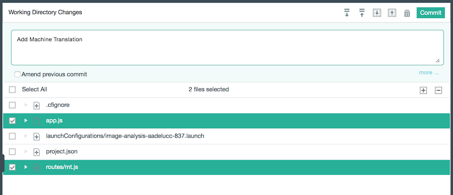
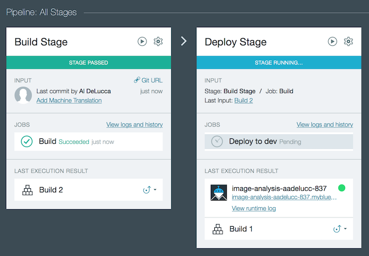

# World of Watson Labs - Image Analysis
 
This lab is part of a Drop In Lab during World of Watson 2015 at NYC. The labs cover several [Watson Services][wdc_services] that are available on [IBM Bluemix][bluemix] to build a simple travel advisor application. Throughout the workshop, we will navigate through Bluemix, Github, and the source code of our application in order to demonstrate how apps can be created quickly and easily using the [IBM Bluemix][bluemix] platform and the value of [Watson Services][wdc_services] and Cognitive capabilities through APIs.

So let’s get started. The first thing to do is to build out the shell of our application in Bluemix.

## Creating a [IBM Bluemix][bluemix] Account

  1. Go to [https://ace.ng.bluemix.net/](https://ace.ng.bluemix.net/)
  2. Create a Bluemix account if required.
  3. Log in with your IBM ID (the ID used to create your Bluemix account)

**Note:** The confirmation email from Bluemix mail take up to 1 hour.

## Deploy this sample application in Bluemix

  1. Click the button below to fork the project into IBM DevOps Services and deploy your own instance of this application on [IBM Bluemix][bluemix].

  [](https://bluemix.net/deploy?repository=https://github.com/aldelucca1/image-analysis)

  2. From here you will be taken to a Bluemix page, where you will be prompted to name your app. A sample name is provided for you, but feel free to give your application any name you like (if the name is taken by another user you will be prompted to try another name).

  

  **Note:** Use the default settings for Region / Organization / Space on the Bluemix landing page.

  3. Once you have named your application, click the deploy button to begin the deploy process to Bluemix. During this process, Bluemix will automatically build and deploy our starter application based on the Github repository that we accessed at the start of the lab.

  4. Once the application has finished deploying, you will see a "Success!" message. At this point, scroll to the top of the page and select "Dashboard" from the header bar.

  

  5. Test Out the new app. Now that we have deployed our application to Bluemix, the next step is to test out the application in its current state. Afterwards we will build out more functionality into the application.
  
## Add services to the application

  1. So far, we have deployed our pre built starter application to Bluemix. We are going to show how easy it is to add additional Watson services to our applications using Bluemix.

  On the Bluemix Dashboard, scroll down to find your Image Analysis application within the "Applications" section. From here, click on the application to open the application homepage.
  
  
  
  2. Within the application homepage, we are able to see what services we have already included. You will notice that we already have Text to Speech and Visual Recognition built into the application. We are now going to add a third service into the application.
To do this, click the "Add a Service or API" button on the homepage

  
  
  3. From the list of Watson services, select the Language Translation service and add it to your application. For the purposes of this lab, all of the default settings of the service will work, so when presented with the Language Translation details page, select the green "Create" button to proceed.

  
  
  **Note:** you may be prompted to restage your application at this point. This is required in order to rebuild the application with the new Language Translation service that we have added. Select "Restage" to proceed.
  
## Test out the application

  1. Once the services are loaded, you will be able to launch the existing pre-built application. To launch the application, click the link next to "Routes" which should follow the naming convention *\<your app name\>*.mybluemix.net

  
  
  When launched, you will be able to see the simple image recognition application, that allows a user to select a photo and identify the captured image. When clicking on the speaker button button in the bottom right hand corner you will hear the identified description.
Let’s test the application out. 

  2. Select the icon in the top right hand corner to prompt for image upload. On the desktop, we have provided some sample images in order to test out the application.

  

  3. When the image has been recognized, click on the Speaker icon to hear the description of the image spoken to you.
  
We are going to demonstrate how easy it is to use the Watson services on Bluemix to add functionality to existing applications. Our current application can identify images and read out that identification using audio. However let’s say that we wanted to be able to identify these images for a wider user base, which requires translation into other languages.

Luckily, we’ve already started the process to do this. To fully implement the ability to translate these descriptions in our application, we are going to edit our application code to add the Language Translation service that we added earlier.
  
## Modify the existing application

  1. Let’s edit our source code. Back on the application home page in Bluemix, you will see a link to the Jazz Hub repository, and a button to **Edit Code**.
  Click on **Edit Code.**

  2. Clicking on Edit Code will take you to the Jazz Hub repository, which will allow us to edit and push new versions of our code to the application.
  
  Within the Github repository, navigate to routes folder and select **File -> New -> File** and name the new file `lt.js`

  3. Open up `lt.js` and copy the code below:  

  ```js
  "use strict";
	
  var fs = require("fs"),
      extend = require("util")._extend,
      watson = require("watson-developer-cloud"),
      bluemix = require("../config/bluemix");

  module.exports = function() {
  
       var languageTranslation = watson.language_translation(extend({
          version: "v2",
          username: "<<service_username>>",
          password: "<<service_password>>",
       }, bluemix.getServiceCreds("language_translation")));
     
       return {
          translate: function(req, res) {
               var params = {
                    text: req.body.text,
                    source: "en",
                    target: "es"
               };
               languageTranslation.translate(params, function(error, result) {
                   if (error) {
                       return res.status(error.error ? error.error.code || 500 : 500).json({ error: error });
                   } else {
                       return res.json(result);
                   }
               });
           } 
       };
  }();
  ```

  The code above will connect the app to the [Language Translation][lt_service] service.
  
  4. Click on File -> Save or press Crt+S.
  
  5. Open up your `app.js` and import the newly created `routes/lt.js`. This can be done by adding the following to line 22: 
    
  ```js
  var lt = require("./routes/lt");
  ```

  6. Finally, configure the route in your `app.js` by adding the following to line 31:

  ```js
  app.post("/translate", lt.translate);
  ```
  
  7. Click on File -> Save or press Crt+S.

## Deploy

  1. The last step in order to complete our application is to deploy our changes to Bluemix. To do this, we need to push our new code to the application. In the code editor screen, switch to the Git view, the 2nd icon in the left navigation bar.

  

  2. Locate your change to app.js file. Check it (select it), add a commit message, and click **Commit**.

  

  3. Click **Sync** to send your changes from this workspace to the main repository and trigger a deploy of your app.

  

  4. Finally, Click on **Build and Deploy** to see the deploy process.

  

**Note:** While this may show as overly complicated, we show it here to illustrate you can have exactly the same source management practices you could have your local environment connected to a Git repository, in the Bluemix DevOps environment.

## Test

To test out our application, navigate back to your application homepage on Bluemix. Select the URL next to "Route" in the same way that we launched our previously unfinished application before.
The new application will perform the same functions are our previous version, but this time you will see translation for the images as well.

# Congratulations 
You have completed the Image Analysis Lab! :bowtie:

[bluemix]: https://console.ng.bluemix.net/
[wdc_services]: http://www.ibm.com/smarterplanet/us/en/ibmwatson/developercloud/services-catalog.html
[lt_service]: http://www.ibm.com/smarterplanet/us/en/ibmwatson/developercloud/language-translation.html